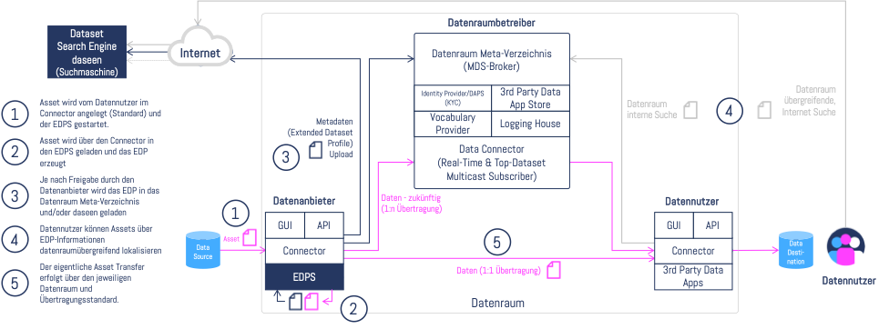
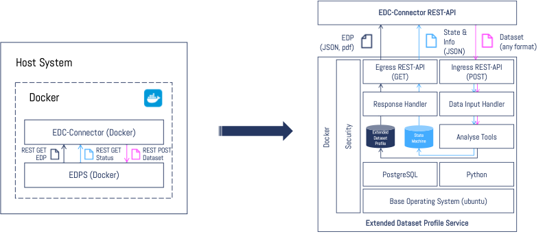
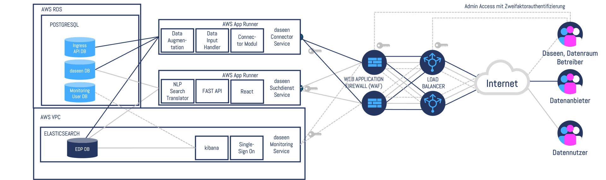
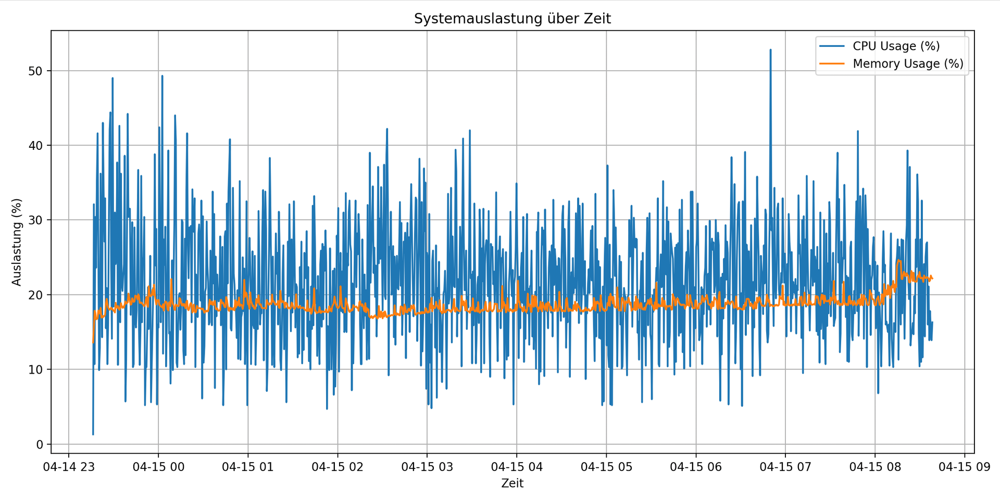

# Federated Data Scout

## 1. Executive Summary

### 1.1 Projektüberblick

Vertrauenswürdige künstliche Intelligenz („KI“) benötigt für effektives Training und präzise Vorhersagen vor allem qualitativ hochwertige Daten. Obwohl täglich enorme Datenmengen entstehen, liegt nur ein Teil davon in verwertbarer, kuratierter Form vor. Eine zentrale Herausforderung besteht darin, dass bisher keine Suchfunktion existiert, mit der man über verschiedene Datenräume und -portale hinweg gezielt nach Datensätzen anhand von analytischen Eigenschaften und unabhängig der zahlreichen domänenspezifischen Ontologien suchen kann.

Hier setzt der **Federated Data Scout** an.

### 1.2 Schlüsselkomponenten

Der Federated Data Scout besteht aus der **Dataset Search Engine (daseen)** und dem verteilten Microservice **Extended Dataset Profile Service (EDPS)**.

- Daten Assets werden mittels EDPS analysiert.
- Die Ergebnisse werden im **Extended Dataset Profile (EDP)** gespeichert.
- Nur EDPs mit gültiger Schema-Version können in daseen verwendet werden.
- Die eigentlichen Daten verbleiben beim Anbieter – daseen fungiert als föderierte Suchplattform.

## 2. Projektarchitektur – Die drei Säulen

### 2.1 Der Bausatz (Softwaremodule)

#### 2.1.1 Übersicht der Module

*Abbildung 1 („Asset und EDP Flow“) illustriert den Informationsfluss von Asset und EDP sowie die schematische Abfolge der einzelnen Schritte zur Erzeugung eines EDP.*

#### 2.1.2 Technische Spezifikationen

Repositories:

- [LP-EDP](https://github.com/Mission-KI/LP-EDP)
- [LP-EDPS](https://github.com/Mission-KI/LP-EDPS)
- [LP-Core](https://github.com/Mission-KI/LP-Core)
- [LP-EDC-Plugin](https://github.com/Mission-KI/LP-EDC-Plugin)
- [LP-Nautilus-Plugin](https://github.com/Mission-KI/LP-Nautilus-Plugin)
- [LP-MDS-Ontology-Mapper](https://github.com/Mission-KI/LP-MDS-Ontology-Mapper)

Weitere Details sind den EDPS und daseen Detail-Umsetzungskonzepten zu entnehmen, die zur Vorbereitung des Projektes erstellt wurden.

### 2.2 Dokumentation

#### 2.2.1 Funktionale Dokumentation

Die funktionale Dokumentation von daseen sowie Details zu den im EDPS durchgeführten Analysen sind im Hilfebereich von daseen zu finden: https://app.daseen.de/help/ 

#### 2.2.2 Technische Dokumentation

Technische Dokumentation ist in den jeweiligen Repositories enthalten:

- **EDPS API** → Swagger
- **daseen Connector Module** → Swagger
- **EDPS Developer Docs** → Markdown im Repository
- **EDP Schema Beschreibung (menschenlesbar)** → [Release 1.0.0](https://github.com/Mission-KI/LP-EDP/releases/tag/1.0.0)

### 2.3 Web-Plattform (Landing Page)

#### 2.3.1 Öffentliche Schnittstelle

**Frontend**

- Landing Page: [https://www.daseen.de](https://www.daseen.de)
- Suchportal: [https://app.daseen.de](https://app.daseen.de)

**daseen Connector Service (API)**
- daseen Connector Service (API): Nur für registrierte Nutzer

## 3. Integration und Synergien

### 3.1 Übergreifende Prozesse

#### 3.1.1 Qualitätssicherung

Automatisierte Tests sind in den Repositories enthalten. Eine Ausführung kann über die in den Repositories mitgelieferten GitHub Workflows angestoßen werden.

#### 3.1.2 Versionierung

Die Versionierung erfolgt mittels Git.

### 3.2 Datenfluss und Kommunikation

#### 3.2.1 Systemarchitektur-Diagramme

*Abbildung 2 („EDPS-Architektur am Beispiel EDC-basierte Datenräume“) zeigt die EDPS-Architektur am Beispiel EDC Integration.*

*Abbildung 3 („daseen Architektur“) illustriert die angebotene Microservice Infrastruktur und die Zugriffswege auf den Service für die einzelnen Persona.*

#### 3.2.2 Kommunikationswege

*Abbildung 4 („Asset und EDP Flow“) illustriert den Informationsfluss von Asset und EDP sowie die schematische Abfolge der einzelnen Schritte zur Erzeugung eines EDP.*

---

## 4. Lösungsstrategie

### 4.1 Technologieentscheidungen

Details hierzu sind den EDPS und daseen Detail-Umsetzungskonzepten zu entnehmen, die zur Vorbereitung des Projektes erstellt wurden.

### 4.2 Architekturprinzipien

Details hierzu sind den EDPS und daseen Detail-Umsetzungskonzepten zu entnehmen, die zur Vorbereitung des Projektes erstellt wurden.

## 5. Systemdesign

### 5.1 Bausteinsicht

#### 5.1.1 Software-Bausatz

*Abbildung 5 („Asset und EDP Flow“) illustriert den Informationsfluss von Asset und EDP sowie die schematische Abfolge der einzelnen Schritte zur Erzeugung eines EDP.*

*Abbildung 6 („EDPS-Architektur am Beispiel EDC-basierte Datenräume“) zeigt die EDPS-Architektur am Beispiel EDC Integration.*

#### 5.1.2 Dokumentationssystem

Markdown & Swagger Dokumentation sind in den Repositories enthalten.

#### 5.1.3 Web-Plattform (Landing Page)

*Abbildung 7 („daseen Architektur“) illustriert die angebotene Microservice Infrastruktur und die Zugriffswege auf den Service für die einzelnen Persona.*

### 5.2 Laufzeitsicht

#### 5.2.1 Hauptszenarien

Detaillierte Beschreibungen der Anwendungsfälle sind den EDPS und daseen Detail-Umsetzungskonzepten zu entnehmen, die zur Vorbereitung des Projektes erstellt wurden.

#### 5.2.2 Interaktionsdiagramme

Relevante Diagramme sind in der Dokumentation der Anwendungsfälle enthalten.

#### 5.2.3 Performance-Aspekte

Während der durchgeführten Lasttests wurden 10 parallele EDPS-Instanzen betrieben, die etwa 14.000 Importe erzeugten. Die Grafik zeigt die Systemauslastung über die Zeit, wobei sowohl die CPU- als auch die Speicherauslastung aufgezeichnet wurden. 

Die CPU-Auslastung zeigt eine hohe Variabilität mit häufigen Spitzen, die gelegentlich 50% überschreiten. Dies deutet auf intermittierende Verarbeitungshöhepunkte hin, die wahrscheinlich durch gleichzeitige Importaufgaben verursacht werden. Trotz der Schwankungen bleibt die durchschnittliche CPU-Auslastung im verwaltbaren Bereich, was darauf hinweist, dass das System die parallele Verarbeitung ohne größere Engpässe bewältigte.

Die Speicherauslastung zeigt hingegen ein stabileres Muster und bleibt konstant zwischen 17% und 22%. Diese Stabilität deutet darauf hin, dass der Speicherbedarf der EDPS-Instanzen gut im Griff war und selbst unter kontinuierlicher Belastung nicht signifikant anstieg.

Insgesamt zeigte das System eine solide Leistung unter Last, mit unter Kontrolle gehaltenem Speicherverbrauch und einer CPU, die den hohen Importdurchsatz mit gelegentlichen Spitzen verarbeitete.

## 6. Qualitätssicherung

### 6.1 Teststrategien

#### 6.1.1 Unit Tests
Unit Tests sind in den Repositories enthalten. Eine Ausführung kann über die in den Repositories mitgelieferten GitHub Workflows angestoßen werden.

#### 6.1.2 Integrationstests
Integrationstests sind in den Repositories enthalten. Eine Ausführung kann über die in den Repositories mitgelieferten GitHub Workflows angestoßen werden.

#### 6.1.3 Systemtests
Systemtests sind in den Repositories enthalten. Eine Ausführung kann über die in den Repositories mitgelieferten GitHub Workflows angestoßen werden. Weitere Prüfungen erfolgten via Bulk Import.

### 6.2 Code-Qualität
Die Code-Qualität wird mittels Pipelines (GitHub Workflows) sichergestellt.

## 7. Anhänge

### 7.1 Referenzen

#### 7.1.1 Externe Standards

- **Ocean Protocol**  
  [Developers](https://docs.oceanprotocol.com/)  
  [Architecture Overview](https://docs.oceanprotocol.com/concepts/architecture/)

- **Eclipse Dataspace Components**  
  [Documentation](https://eclipse-tractusx.github.io/)

---

